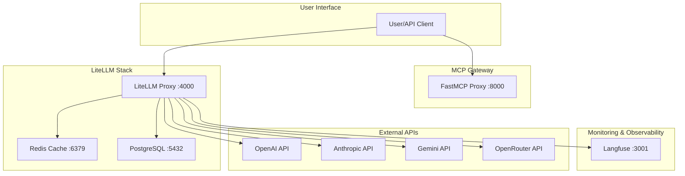

# AI Infra

LLM Gatewayとその包括的な可観測性スタックを提供します。

## アーキテクチャ概要



## サービス一覧

| サービス | ポート | 説明 | URL |
|---------|--------|------|-----|
| FastMCP Proxy | 8000 | MCPプロキシゲートウェイ | http://localhost:8000/mcp |
| LiteLLM Proxy | 4000 | LLMプロキシサーバー | http://localhost:4000 |
| PostgreSQL | 5432 | メタデータストレージ | - |
| Redis | 6379 | キャッシュストレージ | - |
| Langfuse Web | 3001 | LLM観測プラットフォーム | http://localhost:3001 |
| ClickHouse | 8123 | 分析データベース | - |
| MinIO | 9190 | オブジェクトストレージ | - |

## クイックスタート

```bash
# 環境変数の設定
dotenvx set OPENAI_API_KEY your_openai_key
dotenvx set ANTHROPIC_API_KEY your_anthropic_key
dotenvx set GEMINI_API_KEY your_gemini_key
dotenvx set OPENROUTER_API_KEY your_openrouter_key
dotenvx set LITELLM_MASTER_KEY $(openssl rand -hex 32)

dotenvx run -- docker compose up -d
```

## 詳細なセットアップ

初期設定やLangfuseの設定方法など、詳細な手順については [SETUP.md](SETUP.md) を参照してください。
